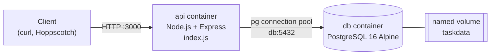

# Task Management API

A containerized REST API for managing tasks, built with **Node.js, Express and PostgreSQL**. The whole stack (API plus database) starts with one command and keeps its data across restarts.

```bash
docker compose up --build
```

It is a deliberately small service, built to show the engineering habits I bring to client work: clean API contracts, safe database access, reproducible environments and honest documentation.

---

## What this demonstrates

| Capability | Where to see it |
|------------|-----------------|
| Clean REST design with correct status codes (`200`, `201`, `204`, `400`, `404`) | [API reference](#api-reference) |
| Safe database access: every query is parameterized, so user input can never run as SQL | `index.js` |
| Reproducible environments: one command brings up the API and its database on any machine | `compose.yaml`, `Dockerfile` |
| Persistent storage: data survives a full stack restart through a named Docker volume | [Proving persistence](#proving-persistence) |
| Idempotent startup: the table is created if missing and the seed data is inserted only once | `db.js` |
| Migration experience: the same API moved from memory to SQLite to PostgreSQL without changing its contract | [How it evolved](#how-it-evolved) |

---

## Table of contents

1. [Architecture](#architecture)
2. [Quick start](#quick-start)
3. [API reference](#api-reference)
4. [Try it with curl](#try-it-with-curl)
5. [Proving persistence](#proving-persistence)
6. [Looking inside the database](#looking-inside-the-database)
7. [Swagger UI (SQLite version)](#swagger-ui-sqlite-version)
8. [Running the SQLite version without Docker](#running-the-sqlite-version-without-docker)
9. [Project structure](#project-structure)
10. [How it evolved](#how-it-evolved)
11. [Design decisions](#design-decisions)
12. [Current limitations](#current-limitations)
13. [Roadmap](#roadmap)
14. [Security notes](#security-notes)

---

## Architecture



- **API container:** Express handles routing, input validation and status codes. Every database call is a parameterized query. The image is built from `node:18-alpine`.
- **Database container:** the official `postgres:16-alpine` image.
- **Network:** Docker Compose puts both containers on one private network. The API reaches the database by its service name (`db`), not `localhost`, and the database port is not published to your machine.
- **Persistence:** the named volume `taskdata` holds the Postgres data directory, so rows outlive the containers.

---

## Quick start

**Prerequisites:** [Docker Desktop](https://www.docker.com/products/docker-desktop/) (running) and [Git](https://git-scm.com/).

```bash
git clone https://github.com/ernestmwangombe/task-management-api.git
cd task-management-api
docker compose up --build
```

No `.env` file is needed for the Docker stack: `compose.yaml` passes the database settings to both containers directly. `.env.example` lists the variable names for reference.

In a second terminal:

```bash
curl -i http://localhost:3000/tasks
```

You should get `200 OK` and three seeded tasks. The first start creates the `tasks` table and seeds three example tasks. Every later start sees existing rows and skips the seed, so the examples never multiply.

Stop the stack and keep your data:

```bash
docker compose down
```

**If the API exits on the very first start:** the database container can take a few seconds to accept connections the first time it initializes. The API will stop with a "database initialization failed" message. Start it again with `docker compose up` (or `docker compose restart api`) and it connects normally.

---

## API reference

Base URL: `http://localhost:3000`

| Method | Endpoint | Purpose | Success | Errors |
|--------|----------|---------|---------|--------|
| `GET` | `/tasks` | List all tasks, ordered by id | `200` | `500` |
| `GET` | `/tasks/:id` | Get one task | `200` | `400` bad id, `404` not found, `500` |
| `POST` | `/tasks` | Create a task | `201` | `400` missing or empty title, `500` |
| `PUT` | `/tasks/:id` | Update a task's title and done flag | `200` | `400` bad id or title, `404`, `500` |
| `DELETE` | `/tasks/:id` | Delete a task | `204` (empty body) | `400` bad id, `404`, `500` |

**Task shape**

```json
{
  "id": 1,
  "title": "Responding to routine client emails",
  "done": false
}
```

**Error shape**

```json
{ "error": "Task not found" }
```

**Behavior notes**

- `POST /tasks` requires a non-empty string `title`. `done` is optional and defaults to `false`.
- `PUT /tasks/:id` requires a non-empty string `title`. If `done` is omitted it is stored as `false`, so send both fields when updating.
- Titles are trimmed of leading and trailing whitespace before they are stored.
- A successful `DELETE` returns `204` with no body.
- Send requests with the header `Content-Type: application/json` and a JSON body. See [Current limitations](#current-limitations) for what happens when the body is missing entirely.

---

## Try it with curl

Run these in order for the full create, read, update, delete cycle. On Windows PowerShell, use `curl.exe` (plain `curl` is an alias for a different command there).

**1. Create a task** (expect `201 Created`)

```bash
curl -i -X POST http://localhost:3000/tasks \
  -H "Content-Type: application/json" \
  -d '{"title":"Prepare quarterly infrastructure report"}'
```

```http
HTTP/1.1 201 Created
Content-Type: application/json; charset=utf-8

{"id":4,"title":"Prepare quarterly infrastructure report","done":false}
```

**2. Read it back** (expect `200 OK`)

```bash
curl -i http://localhost:3000/tasks/4
```

**3. Mark it done** (expect `200 OK`)

```bash
curl -i -X PUT http://localhost:3000/tasks/4 \
  -H "Content-Type: application/json" \
  -d '{"title":"Prepare quarterly infrastructure report","done":true}'
```

**4. Delete it** (expect `204 No Content`)

```bash
curl -i -X DELETE http://localhost:3000/tasks/4
```

**5. Confirm it is gone** (expect `404 Not Found`)

```bash
curl -i http://localhost:3000/tasks/4
```

```http
HTTP/1.1 404 Not Found
Content-Type: application/json; charset=utf-8

{"error":"Task not found"}
```

**6. Trigger validation** (expect `400 Bad Request`)

```bash
curl -i -X POST http://localhost:3000/tasks \
  -H "Content-Type: application/json" \
  -d '{}'
```

```http
HTTP/1.1 400 Bad Request
Content-Type: application/json; charset=utf-8

{"error":"Title is required"}
```

---

## Proving persistence

```bash
# 1. Create a task
curl -i -X POST http://localhost:3000/tasks \
  -H "Content-Type: application/json" \
  -d '{"title":"Still here after a full restart"}'

# 2. Tear the whole stack down (containers removed, volume kept)
docker compose down

# 3. Bring it back up
docker compose up --build

# 4. The task is still in the list
curl -i http://localhost:3000/tasks
```

The task survives because the `taskdata` volume lives outside the container. To wipe the data on purpose, add `-v`, which also deletes the volume:

```bash
docker compose down -v
```

---

## Looking inside the database

The API and `psql` read the same rows, so there is no syncing step. With the stack running, open a SQL prompt inside the database container:

```bash
docker compose exec db psql -U postgres -d tasks
```

Then try:

```sql
\dt
SELECT * FROM tasks ORDER BY id;
SELECT COUNT(*) FROM tasks WHERE done = true;
\q
```

Any change made in `psql` shows up in `GET /tasks` immediately.

---

## Swagger UI (SQLite version)

The earlier SQLite version of the service (`server.js`) serves interactive OpenAPI 3.0 documentation at `http://localhost:3000/docs`, generated from the hand-written `openapi.json`. Every endpoint has a "Try it out" button, so the full create, read, update, delete cycle can be run without curl. See [how to run it](#running-the-sqlite-version-without-docker).


| Step | Screenshot |
|------|------------|
| Create a task |  |
| Task created |  |
| Get a task |  |
| Task found |  |
| Update a task |  |
| Marked as done |  |
| Delete a task |  |
| Task deleted |  |

The PostgreSQL version (`index.js`, the one the Docker stack runs) exposes the same five task endpoints but does not serve `/docs`.

---

## Running the SQLite version without Docker

This is the earlier milestone, kept in the repo. It needs Node.js 18 or newer. SQLite is a single file, so no database install is required.

Stop the Docker stack first (`docker compose down`), because both versions use port 3000. Then:

```bash
npm install
npm install --no-save better-sqlite3 swagger-ui-express
node server.js
```

The second command installs the two packages that only this version needs. `--no-save` keeps `package.json` unchanged.

- API: `http://localhost:3000`
- Swagger UI: `http://localhost:3000/docs`
- Data file: `tasks.db`, created next to `database.js` on first run with the `tasks` table and three seeded tasks. Delete it to reset. It is not git-ignored yet, so do not commit it.

---

## Project structure

```
task-management-api/
├── index.js            # Main entry point: Express routes backed by PostgreSQL
├── db.js               # Storage module: pg pool, table creation, seed-once logic
├── server.js           # SQLite entry point: Express routes + Swagger UI
├── database.js         # SQLite storage module: WAL mode, transactional seed
├── openapi.json        # OpenAPI 3.0 spec served at /docs by server.js
├── Dockerfile          # API image (node:18-alpine)
├── compose.yaml        # api + db services and the taskdata volume
├── ScreenShots/        # Swagger UI screenshots used in this README
├── .env.example        # Variable names for running outside Docker
├── .dockerignore       # Keeps .env and local files out of the image
├── .gitignore          # Keeps .env and node_modules out of git
├── package.json
└── package-lock.json
```

---

## How it evolved

The same five endpoints were kept stable while the storage underneath changed twice. This is the core migration skill: the API is the promise, and the database is just the filing cabinet behind it.

| Phase | Where tasks live | What was built |
|-------|------------------|----------------|
| 1. In-memory API | A JavaScript array | Express server, `GET /` and `GET /health`, read endpoints with JSON `404`, `POST` with validation, `PUT` and `DELETE`, OpenAPI 3.0 spec and Swagger UI |
| 2. SQLite | A `tasks.db` file on disk | Table created automatically, seed-once logic in a transaction, every endpoint rewritten as a parameterized SQL query, data survives restarts |
| 3. PostgreSQL in Docker | Rows in a Postgres 16 container | Connection pool, `RETURNING *` queries, `Dockerfile` and `compose.yaml`, named volume |

The git history follows these phases commit by commit.

---

## Design decisions

- **Parameterized queries everywhere.** Values travel separately from the SQL text (`$1` in Postgres, `?` in SQLite), so user input is always treated as data.
- **Validate at the edge.** Non-numeric ids and empty titles are rejected with a `400` before any query runs.
- **Idempotent startup.** The table is created with `CREATE TABLE IF NOT EXISTS`, and the seed runs only when `COUNT(*)` is `0`, so restarts never duplicate data.
- **Schema before traffic.** `index.js` awaits schema setup before opening its port, and exits with an error if the database is unreachable.
- **Connection pooling.** Postgres connections are expensive to open, so `pg.Pool` keeps a few warm and lends them per query.
- **`RETURNING *`.** `INSERT`, `UPDATE` and `DELETE` return the affected row in the same round trip, which gives the generated `id` and a reliable `404` check without a second query.
- **Defensive body handling in the SQLite version.** A request with no body once crashed a handler with a `500`. `server.js` now falls back to an empty object so malformed requests get a clean JSON `400`.
- **Consistent contracts.** Errors are always `{ "error": "..." }`, and the same status codes hold across all three storage engines.

---

## Current limitations

Documented honestly, so nobody is surprised:

- **A request with no body at all** (no `Content-Type` and no data) sent to `POST /tasks` or `PUT /tasks/:id` on the PostgreSQL version returns a `500` instead of a `400`. Sending `{}` with the JSON header correctly returns `400`. The SQLite version already handles this case.
- **Neither version serves `GET /` or `GET /health`.** Those existed in the earliest in-memory phase only.
- **The PostgreSQL version does not serve Swagger UI.** `/docs` exists only in the SQLite version.
- **The database password is a development default** (`dev`), set directly in `compose.yaml`. See [Security notes](#security-notes).
- **`depends_on` waits for the database container to start, not to be ready.** See the first-start note in [Quick start](#quick-start).
- **`PUT` replaces the title and done flag together** rather than patching a single field.
- **The SQLite version needs two extra packages** that are not in `package.json` (see its run instructions).
- There is no authentication, pagination, or automated test suite yet.

---

## Roadmap

**Next: connect to Supabase.** The app already speaks standard PostgreSQL through `pg`, so the core of the change is configuration rather than a rewrite. Planned work:

1. Create a Supabase project and move the `tasks` schema there as a proper SQL migration instead of startup code.
2. Point `DATABASE_URL` at the Supabase connection string, and enable TLS in the `pg` pool configuration.
3. Choose between Supabase's direct and pooled connection strings based on where the API runs, and size the pool to match.
4. Keep the Docker Compose stack as the local development environment, with Supabase as the hosted one.
5. Review Supabase's row-level security settings for the `tasks` table before exposing anything publicly.

**Housekeeping planned alongside it:**

- Move the database password out of `compose.yaml` into `.env`.
- Add a database health check so the API starts only when Postgres is ready.
- Return `400` for requests with no body.
- Add `GET /health` and Swagger UI to the PostgreSQL version.
- Declare every dependency in `package.json`, and git-ignore `tasks.db`.

---

## Security notes

- All SQL is parameterized.
- `.env` is git-ignored and excluded from the Docker image through `.dockerignore`.
- The database port is not published to the host.
- Errors return generic JSON messages. Internal details are logged server-side only.
- **`compose.yaml` currently contains a development password (`dev`).** This stack is for local use only. Do not deploy it as-is. Moving credentials into `.env` is on the roadmap.
- The service stores task titles only and holds no personal data.

---

## Author

**Ernest Mwangombe**: IT consultant moving into AI backend engineering, focused on AI integration, backend architecture and workflow automation for client businesses.
